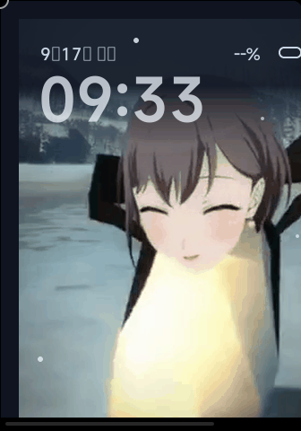

# 咕咕嘎嘎臭企鹅 · TomoriPenguin

小米手环 9 Pro / 10 Pro（336×480，Xiaomi Vela miwear 5.0）动态表盘。
Lua + LVGL 实现，基于社区逆向工具链开发。



## 效果（v4 全屏版）

- **全屏视频动画**：mp4 素材直裁满屏，20 帧 I8 索引色 336×480 @10fps 循环（3.1MB，对齐官方「相变临界」等动态表盘的满屏帧技法）
- **烘焙暗区**：顶部海军蓝渐变 scrim + 底部 vignette 直接烧进每帧，信息区零运行时开销、永不遮挡视频主体
- **氛围动效**：前景微光雪 + 大时间微呼吸
- **数据**：MiSans 64px 大时间（`os.date` 种子 + 30s 对表）、中文日期（几月几日 周几）、电量胶囊

## 平台踩坑实录（miwear 5.0 镜像生存法则）

以下每一条都经过逐项对照实验定位（Face C/D/E/…/L 系列），写表盘前务必阅读 `watchface/fprj/app/lua/main.lua` 头部注释：

| 禁忌 | 后果 | 解法 |
|---|---|---|
| `lvgl.Font("montserrat", *)` | 光栅化原生崩溃，LVGL 循环死亡（屏幕变崩溃转储文本页）| 只用 MiSans（CJK 可用）|
| `dataman.subscribe` 在 init 调用 | 破坏「静态合成 → Live」交接，永远卡在静态渲染 | 禁用 |
| `dataman.subscribe` 在 Timer 内调用 | 显示刷新冻结（Timer 仍在跑但屏幕逐帧不变）| 禁用，时间改 `os.date` + 定时重播 |
| `lvgl.Image` 在 init 创建 | 显示刷新冻结 | 500ms 一次性 Timer 回调内创建帧堆 |
| 全屏帧时代热重载 | 黑屏（改 Lua 或换图都会触发）| 任何改动后 `adb reboot` 冷启动验证 |

其它关键发现：
- **miwear 状态栏 +28px 坐标偏移**：LVGL y 坐标 = 视觉 y − 28（官方参考表盘首个元素 y=27 正是同款补偿；全屏帧不受影响，Label/Object 需上移 28）
- 全局 `Timer()` 不存在（只有 `lvgl.Timer`）；`print()` 输出不可见（无 logcat），调试用 `io.open` 文件日志 + `adb pull`
- 开机时系统先静态渲染 `resource.bin` 再二次启动 Lua 进 Live（日志出现两个 boot 块 = 交接成功）

## 环境与构建

```bash
# 1) Python 依赖（--user 即可，不动全局）
python -m pip install --user pypng lz4 Pillow

# 2) 全量部署到模拟器（含 .face 构建 + 推送 + 重启）
powershell -NoProfile -ExecutionPolicy Bypass -File scripts\pushlua.ps1

# 3) 模拟器截图验收（前后两帧 changed=true = 动效存活）
node tools\shot.mjs qa\shot.png
```

脚本已按本机环境适配：`scripts/internal/load_config.ps1` 注入 adb（进程级 PATH）并锁定 `emulator-5578`，不修改任何全局环境。
注：v4 全屏帧时代 `-Hot` 热重载会导致黑屏，迭代请走全量部署 + 冷启动。

## 素材管线

素材源视频放 `mp4/` 目录（不入库），管线一键重建：

```bash
# 全屏抽帧 + 满屏裁剪 + 顶部渐变暗区/底部 vignette 烘焙（20 帧 @10fps，改脚本头部 SS/DUR/FPS/N 换循环段）
python watchface\assets-src\extract-v4.py

# 转 LVGL I8 索引色 .bin（全屏帧体积减半；I8 渲染已验证色彩正确）
python watchface\tools\LVGLImage.py --cf I8 --ofmt BIN --compress NONE --align 1 \
  --output watchface\fprj\app\images --name f01 <帧>.png

# 生成市场缩略图（DeviceType=367 强校验 230×328）
python watchface\assets-src\make-preview.py
```

## 真机打包

`.fprj` 已设 `DeviceType="367"`（Band 9 Pro；Band 10 Pro 同屏，专属码未公开前按 9 Pro 打包），`scripts\build_face.ps1` 产出 `bin\TomoriPenguin.face`（约 3.5MB，输出 `Watch: MiBand9Pro`）。`watchfaceId` 见 `watchface.config.json`（可用「生成表盘ID」任务更换）。

## 参考 .bin 表盘解包分析

`tools/unpack-ref.py`（移植 [m0tral/UnpackMiColorFace](https://github.com/m0tral/UnpackMiColorFace) 的 FaceV2 格式）可解包官方/第三方动态表盘研究其做法——已验证「相变临界」（46 帧全屏索引色动画）与「哥伦比亚」（4 帧全屏 + 数字图片时间）。三大技法：全屏帧动画底图、图片数字时间、帧内烘焙暗区。

## 目录结构

```
watchface/fprj/app/          # 表盘本体（真机释放内容）
  lua/main.lua               # 入口：全屏帧播放器 + 开机生存法则
  images/f01-f20.bin         # I8 索引色全屏帧堆（3.1MB）
watchface/assets-src/        # 素材管线脚本（extract-v4.py 等）
watchface/tools/              # LVGLImage 转换器 + Compiler.exe（.face 打包）
scripts/                      # 部署/构建脚本（已适配 5578 模拟器）
tools/                        # 截图/手势/分析/表盘解包工具（gRPC）
qa/                           # 验收截图（前后双帧 = 动效证据）
```

## 致谢

- [FangAiden/LuaDevTemplate](https://github.com/FangAiden/LuaDevTemplate) — 本项目脚手架与热重载器
- [FangAiden/Vela_Application_Documentation](https://github.com/FangAiden/Vela_Application_Documentation) — Vela Lua 逆向文档
- [m0tral/UnpackMiColorFace](https://github.com/m0tral/UnpackMiColorFace) — 表盘解包器（本仓库逆向参考格式的基础）
- [米坛社区 BandBBS](https://www.bandbbs.cn/) — Vela 表盘生态与工具
- 高松灯企鹅素材由使用者自备，本仓库不含源视频
